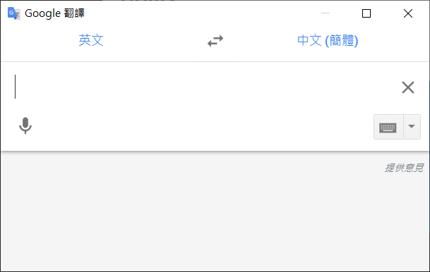

# Google Translate Desktop
Google Translate网页版的封装，通过[Electron](https://www.electronjs.org)构建。

首先说一下建立此仓库的目的。平时写代码经常需要查词，尝试了很多翻译软件，它们都很棒，但总是有些细节让人抓狂。或许作为一个翻译软件它们并没有什么问题，但在我个人的使用条件下，它们无法满足我的需求。

下面是我用过的软件，以及它们为什么不继续使用：
* 任何网页版翻译：需要打开浏览器，太慢
* 金山词霸：不支持DPI自适应，太丑（现在不知道支不支持）
* 有道翻译：关键时刻掉链子，经常需要等待一会才能得到结果。划词窗口偶尔卡半天才出来。最致命的是MINI窗口经常不能自动处于输入状态，得鼠标点一下，大大降低了效率
* Micosoft Translator：启动太慢，又不支持mini窗口。不支持开机自启动。如果一直保持打开得忍受任务栏多出一项，这对于某些强迫症患者（我）来说是难以忍受的

于是我有了使用Electron封装一个网页版翻译的想法，对比之下Google翻译似乎比微软翻译出结果快那么一点点，于是决定封装Google翻译。需要说明的是，我测试的是translate.google.cn，至于google.com没试...I am in China🙃

封装Google翻译的目的是用于写代码时快速查词，就这一个单纯的目的。因此它的功能可以很简单，但必须具备一些必要的功能，另外使用它可能需要忍受一些事情：
* 功能简陋
* 必须联网
* 自定义程度低，配置得直接修改配置文件
* 只能在Windows上用（用到了Windows系统API）
* 在Google Translate页面完全加载前Mini窗口不会自动获取焦点，而这可能需要等待好几十秒

## 特性
* 支持主窗口最小化到托盘；
* 允许配置快捷键打开Mini窗口；
* 允许配置默认主窗口尺寸；
* Mini窗口自动获取输入焦点；
* 支持开机启动；
* 允许Mini窗口隐藏时保持活跃以快速响应；
 

* 不支持离线使用；
* 不支持取词划词；

对于Mini窗口自动获取输入焦点和自动清除输入，由于是通过`dom-ready`事件注入JavaScript实现，因此在`dom-ready`之后才能生效。而这需要大概十几秒，因为`translate.google.cn`尝试从`google.com`获取一些资源，而访问google.com会等待超时后失败（国内环境），但这些资源并不是完成翻译功能所必须的，因此并不影响翻译功能的使用。但未完成的非ajax请求会让`dom-ready`事件迟迟不能触发，导致依赖此事件注入JavaScript的代码直到请求超时后才执行。  
但这只在程序启动时发生，个人认为勉强能够忍受，就没有再折腾。如果有必要，或许可以通过`ServiceWorker`拦截？

另外，在此期间，对于0.2版本可能会出现输入内容离奇消失的情况（每次运行周期最多出现一次）。这是因为程序在Mini窗口隐藏时自动清除输入，但由于注入的JS代码需要`dom-ready`事件后才执行，所以清除输入的代码可能会在不合适的时机被执行。但至多只可能发生一次。

对于封装的url，本程序仅对translate.google.cn做了样式微调，如果换成其它的url，可能需要自行调整样式。配置项中允许更改url参数来加载其他网页。如果需要，还可以通过提供额外CSS来调整样式，它们将被注入页面，见[配置项](##配置项)。  
注意，你可能需要为你的样式加上!important标记以覆盖更高优先级的原始样式，因为CSS以嵌入式CSS的方式插入。

## 实现
通过Electron简单的封装translate.google.cn作为主窗口。

### Mini窗口
Mini窗口的大小是固定的，想要修改只能修改代码。为了在更小区域呈现界面，本程序通过注入css隐藏了Mini窗口的Google Translate头部，还做了一些微调以减小其尺寸。

## 使用
克隆本仓库到本地，然后执行`npm install`。

### 运行
`npm start`

### 打包
#### Windows
`npm run package-win`
#### linux
`npm run package-linux`

通过`electron-packager`进行打包。当然您也可以自定义打包器参数或使用其它Electron打包工具，例如[electron-builder](https://github.com/electron-userland/electron-builder)。但请劳烦您自行配置。

## 配置项

配置文件只能是运行目录下的`config.json`。修改配置可能需要重启程序以应用修改。

| 配置名称 | 类型 | 默认值 | 备注 |
| ----------------------- | ------- | --------------------------- | --------------- |
| mainWindowWidth         | number  | 1024                        | 主窗口宽
| mainWindowHeight        | number  | 586                         | 主窗口高
| url                     | string  | https://translate.google.cn | 加载的url，其它地址没测试过
| autoStart               | boolean | false                       | 开机自启动
| miniWindowEnabled       | boolean | true                        | 启用Mini窗口快捷键
| miniShortcut            | string  | CmdOrCtrl+Alt+M             | 设置Mini窗口快捷键
| extraCssForMain         | string  | ""                          | 额外插入主窗口的CSS
| extraCssForMini         | string  | ""                          | 额外插入Mini窗口的的CSS
| minimizeToTrayWhenClose | boolean | true                        | 关闭主窗口时最小化到托盘
| minimizeToTrayWenStart  | boolean | true                        | 启动时自动隐藏主窗口
| keepActiveInterval      | number  | 60000                       | 自动操作Mini窗口以使其保持活跃的周期，单位ms，最低1000，为0禁止
| skipTrayIcon            | boolean | false                       | 是否隐藏系统托盘图标

注意，在部分linux桌面上动态切换是否显示托盘图标可能会导致托盘图标残留，因此最好直接修改config.json再重启而不是动态修改是否显示托盘图标。

## 使用截图

主窗口

Mini窗口

